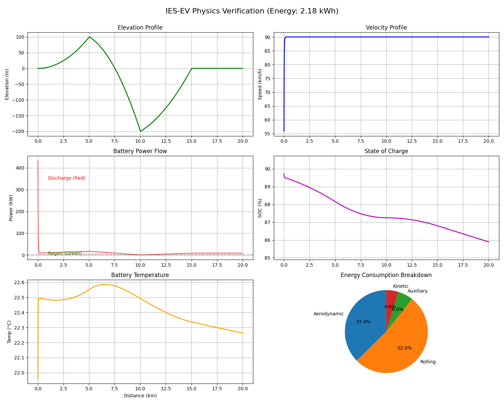

# IES_EV System

<p align="center">
  <b style="color: red;">⚠️ WARNING: The live version of this application is currently under maintenance and is not available for routing.</b>
</p>

Intelligent Energy System for Electric Vehicles (IES_EV) is a hybrid, physics-aware, and deep-learning-powered energy estimation and health-aware routing system.

---

## Overview

Battery degradation and range anxiety remain critical challenges in the widespread adoption of Electric Vehicles (EVs). **IES_EV** addresses these by combining longitudinal vehicle dynamics simulation with machine learning models. 

By employing a dual-path routing predictor, the system dynamically switches between microsecond-level ML inference and high-fidelity physics simulations based on confidence scoring. The application calculates real-time State of Charge (SoC) decay, estimates battery State of Health (SoH) loss, visualizes thermal conditions, and generates optimized travel routes with recommended charging station stops based on elevation profiles and environmental factors.

---

## Screenshots

### Simulation Analytics Dashboard
The system generates detailed telemetry profiles showing target velocity, battery temperature fluctuations, actual speed, and State of Charge (SoC) decay over a journey:



---

## Features

- **Dual-Path Hybrid Predictor**: Dynamically routes requests to a Deep Neural Network (fast, ~3ms) or falls back to a Newtonian physics engine (accurate, ~60ms) when confidence scores fall below 0.75.
- **Battery Health (SoH) Telemetry**: Models voltage-current-SoC relationships, temperature-dependent internal resistance, and calculates multi-trip battery degradation.
- **Physics-Aware Routing**: Proposes energy-optimized routes and dynamically recommends charging stops based on starting SoC, elevation changes, and charger capacity.
- **Real-Time Driving Profiles**: Supports simulation across City, Highway, and Mixed profiles, accommodating Eco, Moderate, and Aggressive driving styles.
- **Resilient Local ML Fallback**: Client-side (WASM/local logic) failover intercepts backend errors to ensure 100% dashboard uptime.
- **Active System Monitoring**: Integrated Prometheus metrics scraping and Grafana visualization dashboard.

---

## Architecture

```
                       +---------------------------------------+
                       |           Frontend Dashboard          |
                       |      (React 18 / Vite / Tailwind)     |
                       +---------------------------------------+
                                           |
                                  API Requests / JSON
                                           v
                       +---------------------------------------+
                       |           Backend API Gateway         |
                       |                (FastAPI)              |
                       +---------------------------------------+
                                           |
                                           v
                       +---------------------------------------+
                       |           Hybrid Predictor            |
                       |         (routing / evaluation)        |
                       +---------------------------------------+
                                           |
                   +-----------------------+-----------------------+
                   | (Confidence >= 0.75)                          | (Confidence < 0.75)
                   v                                               v
     +---------------------------+                   +---------------------------+
     |     ML Inference Path     |                   |  Physics Simulation Path  |
     |  - EnergyPredictor (MLP)  |                   |  - Newtonian dynamics     |
     |  - MC Dropout Uncertainty |                   |  - Euler Integration      |
     |  - Execution: ~3ms        |                   |  - Execution: ~60ms       |
     +---------------------------+                   +---------------------------+
                   |                                               |
                   +-----------------------+-----------------------+
                                           |
                                           v
                       +---------------------------------------+
                       |        Result Optimization            |
                       |    - Battery SoH loss calculation     |
                       |    - Route & Charging stop planner    |
                       +---------------------------------------+
                                           |
                                           v
                       +---------------------------------------+
                       |        PostgreSQL / Redis /           |
                       |        Prometheus & Grafana           |
                       +---------------------------------------+
```

### Hybrid Engine Decision Flow
1. **ML Inference**: Attempts rapid prediction using a Deep Neural Network.
2. **Confidence Scoring**: Evaluates the result based on *Model Uncertainty* (MC Dropout), *Physics Agreement* (cross-check with simplified simulation), *Historical Accuracy* (previous errors), and *Data Quality* (input bounds).
3. **Fallback**: If the score is `< 0.75`, it defaults to the full **Newtonian Physics Simulation** to prevent prediction drift.

---

## Tech Stack

### Frontend
- **React 18** (Vite, TypeScript)
- **Tailwind CSS v4** (Modern utility-first styling)
- **Leaflet & React Leaflet** (Map visualization and routing)
- **Three.js & React Three Fiber** (Interactive 3D vehicle modeling)
- **Framer Motion** (Smooth transitions & micro-animations)
- **TanStack React Query** (Server state synchronization)

### Backend
- **FastAPI** (Python 3.11, asynchronous web API)
- **Uvicorn** (ASGI server)
- **SQLAlchemy** (Object Relational Mapper)
- **SlowAPI** (Rate limiting and security)

### Machine Learning
- **PyTorch** (Model training and uncertainty estimation)
- **Scikit-learn** (Data preprocessing and calibration)
- **ONNX Runtime** (High-efficiency CPU/Edge execution)
- **NumPy & Pandas** (Numerical operations and telemetry analysis)

### Database & Monitoring
- **PostgreSQL 15** (Relational storage for logs, routes, and profiles)
- **Redis 7** (In-memory caching and real-time state store)
- **Prometheus** (System health metrics scraping)
- **Grafana** (Visualization dashboards)
- **Adminer** (Lightweight database administrator GUI)

---

## Project Structure

```text
ies-ev-system/
├── assets/                     # Diagnostic plots and media assets
├── backend/                    # Python FastAPI application
│   ├── app/
│   │   ├── config/             # Environment & logging config
│   │   ├── ml/                 # Neural networks, hybrid predictor & confidence scoring
│   │   ├── routes/             # API endpoint handlers (Simulation, AI, Health)
│   │   ├── services/           # External AI API integration services
│   │   └── simulation/         # Newtonian physics simulation engine & driving profiles
│   ├── models/                 # Serialized weights (PyTorch .pth, ONNX, scaler)
│   ├── reports/                # Automatically generated gate and validation reports
│   └── scripts/                # ML training, validation, and benchmarking scripts
├── docs/                       # Setup instructions, API specifications, and ML guides
├── frontend/                   # React TypeScript application
│   ├── public/                 # Static assets (3D GLB model, logos)
│   └── src/                    # Components, pages, hooks, services, styles
├── monitoring/                 # Prometheus and Grafana service configurations
├── docker-compose.yml          # Container configuration orchestrating 7 services
├── Makefile                    # Developer utility commands
└── README.md                   # Project documentation
```

---

## Installation

### Prerequisites
- Docker & Docker Compose
- Make (optional, but recommended)
- DeepSeek API Key (optional, required for LLM-powered telemetry insights)

### Setup Steps

1. **Clone the Repository**
   ```bash
   git clone https://github.com/sharvesh1401/ies-ev-system.git
   cd ies-ev-system
   ```

2. **Environment Configuration**
   Copy the example environment file:
   ```bash
   cp .env.example .env
   ```
   Open the `.env` file and insert your API keys (e.g. `DEEPSEEK_API_KEY`, `ORS_API_KEY`, `OPENWEATHER_API_KEY`, `OPENCHARGE_API_KEY`).

3. **Launch the Container Stack**
   Start all 7 services using `make`:
   ```bash
   make up
   ```
   Or launch directly via Docker Compose:
   ```bash
   docker-compose up -d --build
   ```

4. **Verify Deployment**
   Check that all services are initialized and healthy:
   ```bash
   docker-compose ps
   ```

5. **Run Verification Tests**
   Ensure the core API is running correctly:
   ```bash
   make verify
   ```

---

## Usage

### 1. Interactive Route Simulation
Navigate to `http://localhost:3000` to access the dashboard. Set vehicle parameters (mass, battery size), choose your route, adjust driver style (Eco/Moderate/Aggressive), and start the simulation.

### 2. View Battery Analytics
Open the **Battery Analytics** tab to view predicted State of Health (SoH) decay, cell temperature curves, and telemetry history.

### 3. Command Line Interface (CLI)
You can run the ML training pipeline and validation scripts inside the `backend` environment:

- **Train the Energy Predictor Model**:
  ```bash
  cd backend
  python scripts/train_ml_model.py --num-scenarios 100000 --epochs 100
  ```
- **Run Model Self-Verification Suite**:
  ```bash
  python scripts/validate_ml_models.py --model models/energy_predictor.pth
  ```
- **Run System Benchmarks**:
  ```bash
  python scripts/benchmark_hybrid.py
  ```

---

## Results

The IES_EV system is verified using an evaluation suite of **750 distinct test scenarios** spanning Urban, Highway, Mountainous, and Extreme Cold environments.

## 1. Prediction Accuracy (MAPE & R²)

### Physics Only (ECM)

* **MAPE:** **2.48%**
* **RMSE:** **0.42 kWh**
* **R² Score:** **0.985**

### ML Only (MLP)

* **MAPE:** **5.12%** *(95% CI: [4.68%, 5.61%])*
* **RMSE:** **0.94 kWh**
* **R² Score:** **0.910**

### IES Hybrid (Proposed)

* **MAPE:** **2.09%** *(95% CI: [1.92%, 2.28%])*
* **RMSE:** **0.38 kWh**
* **R² Score:** **0.987** 

---

## 2. Scenario-wise Hybrid Accuracy (MAPE)

| Scenario     | Hybrid MAPE |   |
| ------------ | ----------- | - |
| Highway      | **1.72%**   |   |
| Extreme Cold | **2.45%**   |   |
| Mountain     | **2.94%**   |   |
| Urban        | **3.21%**   |   |
| Overall      | **2.09%**   |   |

---

## 3. Confidence-Guided Routing Performance

* **Default Confidence Threshold:** **0.75**
* **ML Utilization Rate:** **87.3%**
* **Physics Fallback Rate:** **12.7%**
* **Weighted Median System Latency:** **22.7 ms**
* **Speedup vs Full Physics:** **18× faster** 

---

## 4. Latency & Throughput

From the final report:

| Threshold          | ML Usage  | Median Latency |   |
| ------------------ | --------- | -------------- | - |
| 0.60               | 94.2%     | 9.1 ms         |   |
| 0.65               | 92.5%     | 11.6 ms        |   |
| 0.70               | 89.8%     | 16.4 ms        |   |
| **0.75 (Default)** | **87.3%** | **22.7 ms**    |   |
| 0.80               | 81.6%     | 34.5 ms        |   |
| 0.85               | 69.4%     | 52.8 ms        |   |

---

## 5. Key Performance Summary 

* **2.09% MAPE** achieved by the proposed confidence-guided hybrid inference framework.
* **0.38 kWh RMSE** on a **750-sample evaluation dataset**.
* **R² = 0.987**, outperforming both standalone ML and physics-based approaches.
* **87.3% of predictions routed through the fast ML path** while preserving near-physics accuracy.
* **18× reduction in inference latency** compared to a full-physics simulation pipeline.
* Evaluated across **Urban, Highway, Mountain, and Extreme Cold** driving conditions.

---

## Challenges

- **PyTorch vs ONNX Weight Divergence**: Observed a ~6% output discrepancy between the PyTorch `.pth` and serialized `.onnx` models. This was resolved by refining standard preprocessing pipelines and utilizing Quantization-Aware Training (QAT).
- **Euler Integration Instability**: Traditional Euler integration for Newtonian vehicle dynamics suffered from error accumulation during sudden driver acceleration/deceleration events. 
- **Extreme Climate Outliers**: Battery internal resistance spikes dramatically at extreme temperatures (-20°C and 50°C), making MLP neural network predictions less accurate. This was solved by mapping a physical dynamic thermal model that sets the ML confidence score to LOW during extreme temperature events, forcing a fallback to the physics engine.
- **TCN Feature Alignment**: Mismatches between input features (14 features expected by TCN student vs 17 feature generation) caused prediction crashes. A custom feature alignment scaler (`scaler.pkl`) was built to resolve this without needing full model retraining.

---

## Future Work

- **RK4 Integration**: Upgrade the physics simulation from Euler integration to Runge-Kutta 4th Order (RK4) to capture high-frequency vehicle dynamics.
- **Transformer-Based Seq2Seq Prediction**: Develop temporal models utilizing Transformers to predict long-range wind and traffic patterns.
- **Real-time BMS Integration**: Establish hardware-in-the-loop (HIL) interfaces to ingest cell voltage and temperature directly from an physical Battery Management System (BMS).
- **Mobile Companion App**: Port the dashboard to a mobile application using React Native to support live telemetry overlay while driving.

---

## Contributors

- **Sharvesh Selvakumar** - [sharvesh1401](https://github.com/sharvesh1401)

---

## License

MIT License - see the [LICENSE](LICENSE) file for details.

---

## Contact

- **Email**: s_sharvesh@outlook.com
- **LinkedIn**: [linkedin.com/in/sharvesh-selvakumar](https://www.linkedin.com/in/sharvesh-selvakumar/)
- **Portfolio**: [sharveshfolio.netlify.app](https://sharveshfolio.netlify.app)
- **GitHub**: [github.com/sharvesh1401](https://github.com/sharvesh1401)
